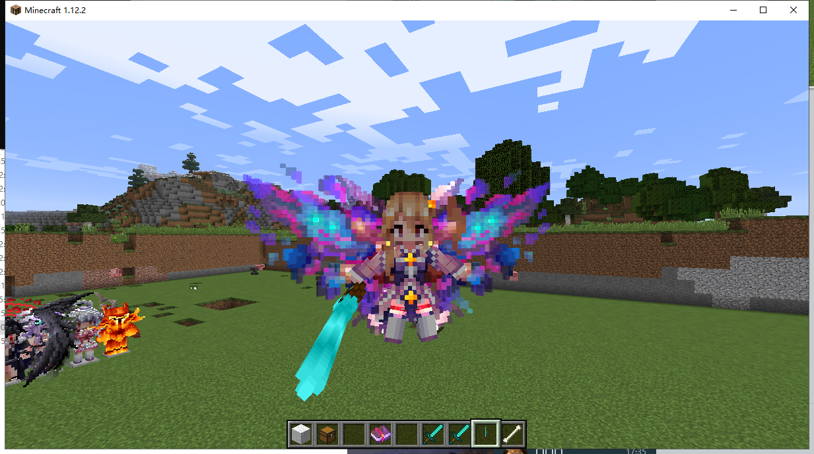
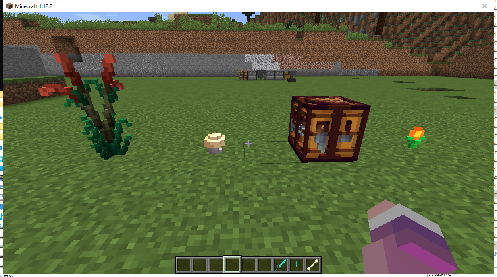
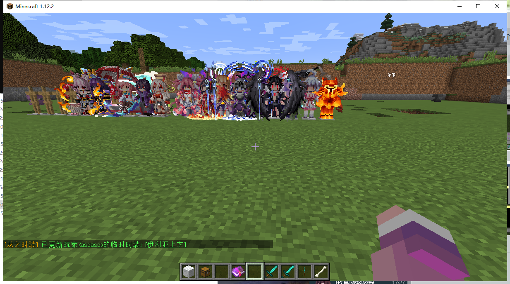
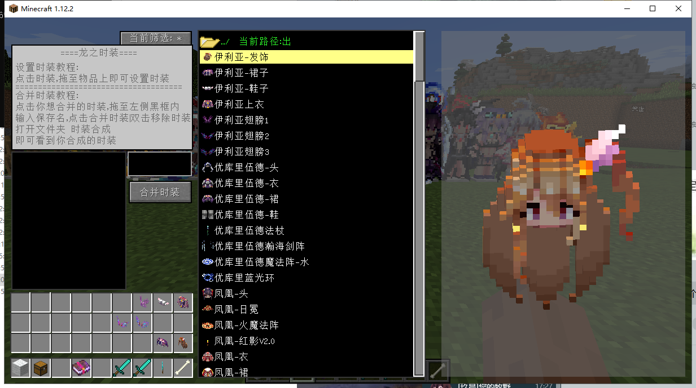
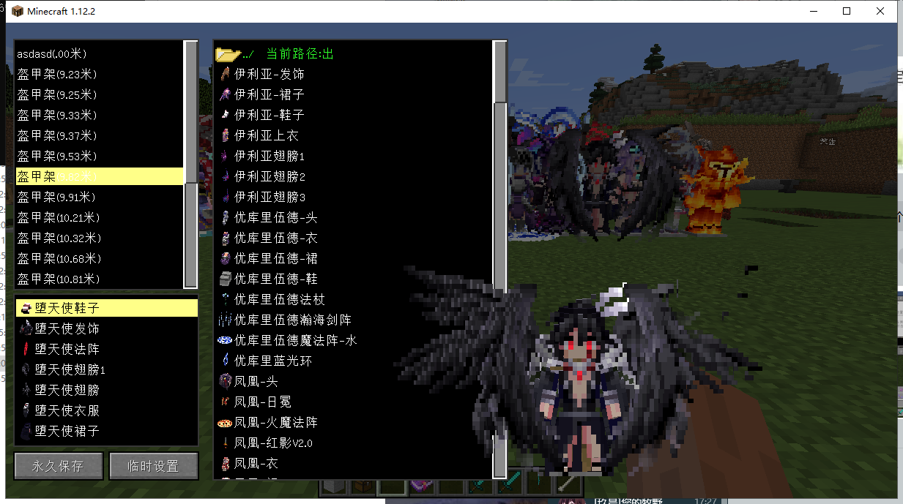
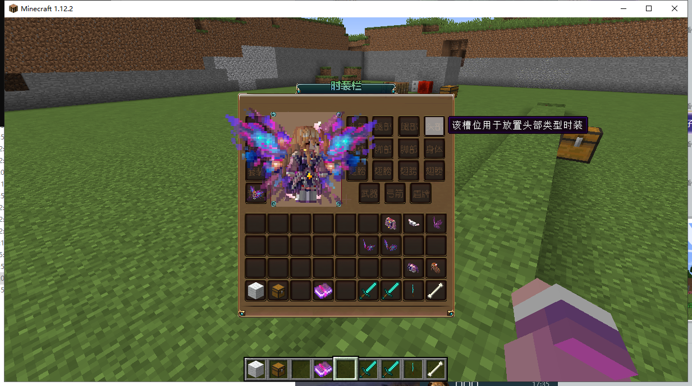

# 龙之时装


目前已开发完成 1.18.x 版本,可联系作者咨询相关问题及价格

Ps: 1.18.x版本无弯曲动作功能


### 插件介绍

> **龙之时装是`服务端-插件`和`客户端-模组`组合的混合型插件**
>
> **该插件售价400元永久,购买可找QQ448780139**
>
> **授权码绑定单个IP,售后群提供机器人自助解绑**

### 使用群体

> 由于它是`服务端-插件`和`客户端-模组`组合的混合型插件,
>
> 因此你可在spigot等纯净服务端上装插件，在客户端上装mod即可达到使用效果
>
> `CatServer,Spigot,Paper 等服务端核心均可使用该插件`
>
> 服务端版本支持: **1.8 - 1.12.2**
>
> 客户端版本支持: **1.12.2**


已新增自定义玩家动作功能, 需要配合<mark style="color:red;">**龙之核心**</mark>使用


### 时装文件及插件兼容

* &#x20;**支持服务端存放时装文件，不必放在客户端，防盗等级MAX**
* **提供API功能可自由拓展权限时装等，拓展支持RPGInventory等**
* **支持AP，SX，PXRPG属性插件，其他插件也可通过API获取时装栏物品进行兼容**
* **支持通过Lore判定显示时装**

### 功能演示

1. **它可为你玩家,NPC,怪物,盔甲架,提供时装效果，并且支持更多弯曲动作(**[**Mobends**](https://www.mcmod.cn/class/526.html)**)**

<figure><figcaption></figcaption></figure>

**2. 它可以放置时装方块**

<figure><figcaption></figcaption></figure>

**3. 它可以在第一人称显示时装手臂**

<figure><figcaption></figcaption></figure>

4.**它具有强大的时装操作界面**

<figure><figcaption></figcaption></figure>

<figure><figcaption></figcaption></figure>

5\. 它可以自定义时装背包

<figure><figcaption></figcaption></figure>
