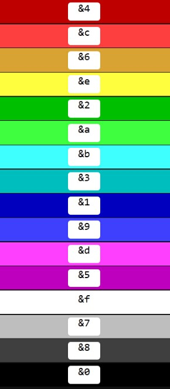

# RGB颜色符号

众所周知，1.12.2原版的颜色符号只有以下几种

<figure><figcaption></figcaption></figure>

而1.16版本的颜色符号可以使用RGB颜色，能够使用上千万个颜色

但是，使用龙核，你也可以在1.12.2使用这样的效果

### 使用示例

原版的颜色符号 §a

扩展RGB颜色符号 §#CCFFFF (RGB颜色可参考\[修改物品附魔颜色]章节里的网站)

### 注意事项

> 由于各个插件并没有兼容如  §a攻击力: §#E4FF11100.0
>
> 这样的颜色符号文本,所以如果对行内容有所识别来获取属性，识别绑定玩家等功能
>
> 会由于不兼容导致异常或失效,如攻击力会变成11100.0
>
> 所以请谨慎使用改颜色符号,尽量不要加到插件需要识别的行上

> Minecraft的颜色符号是§，而不是&
>
> 我们使用各种插件都能用&来设置颜色是因为插件内部代码进行了替换
>
> 而我们经常使用的Lore插件
>
> /lore add \&a这是绿色
>
> 该插件并不会识别 扩展RGB颜色符号 \&#CCFFFF 这样的形式，不会自动将&转换为§
>
> 因此请使用我们内置的/core lore和/core name来设置RGB颜色

### 颜色获取网站





### 为物品设置渐变名

/core name <#ff0000-#1800ff-#00ff48-#e4ff00>喵喵喵喵喵喵喵喵

* 第一个<>内以 - 分割,可设置任意多的渐变色
* 最后以\<end>结尾

### 为物品设置渐变Lore

/core lore <#ff0000-#1800ff-#00ff48-#e4ff00>喵喵喵喵喵喵喵喵
