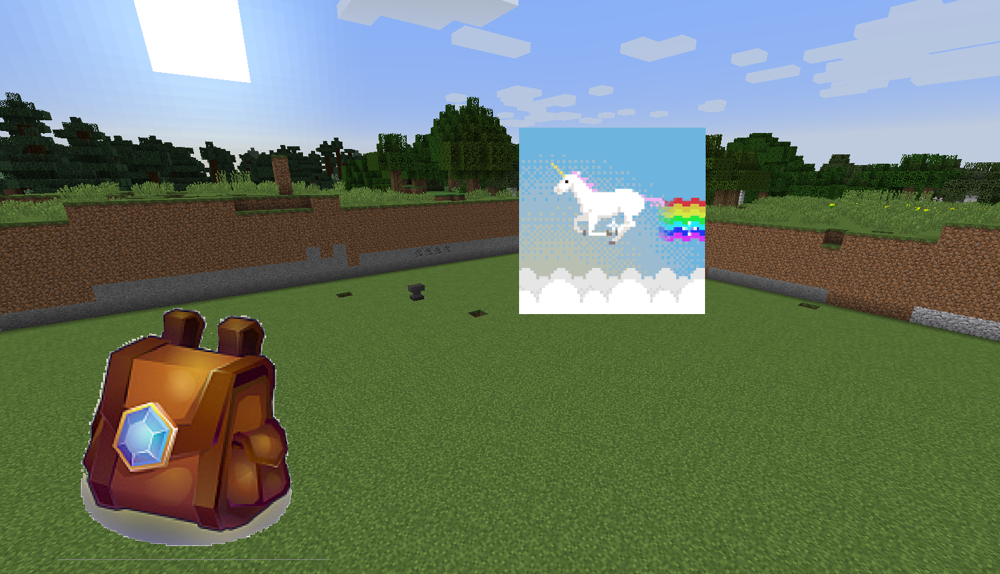

# 世界悬浮贴图

### 什么是世界悬浮贴图

类似于HD全息文字那样，在世界里显示文字一样，但我们这个是显示一幅图片

<figure><figcaption></figcaption></figure>

### 使用教程

只需要一句简单的指令，即可显示图片

**/core worldTexture\_create <节点名> <贴图路径> <宽> <高> <是否跟随玩家视角(true/false)>**

* <节点名>任意，但是不要与其他名称重复
* <贴图路径>如填写  baka/test.png  则需要在客户端该路径放置图片(resourcepacks/DragonCore/baka/test.png)
* <贴图路径>如以\[text]开头,则为显示文字,文字大小由<高>决定,支持papi变量，如：/core worldTexture_create 节点名 \[text]我叫%player_name% 0 1 true

### 进阶配置

```
随便一个名字:
  # 世界名
  world: "world"
  # 中心坐标
  x: 1
  y: 1
  z: 1
  # 旋转角
  rotateX: 50
  rotateY: 50
  rotateZ: 0
  # 图片地址
  path: "backpack.png"
  # 显示的宽度高度
  width: 5
  height: 5
  # 透明度(不要小于0.1,否则会完全透明)
  alpha: 0.5
  # 跟随玩家视角
  follow: false
  # 是否自发光(晚上也能清楚看见)(默认false)
  glow: true
  # 是否穿透地形显示(默认false)
  through: true
  # 玩家多少距离内能看见该贴图(默认64)
  distance: 64
  # 仅在第一视角显示贴图(默认false)
  renderOnFirst: true
```

### 插件API

```
    PacketSender.setPlayerWorldTexture(Player player, String key, WorldTexture worldTexture)
    PacketSender.removePlayerWorldTexture(Player player, String key)
    
    
    // 世界名，只有玩家在该世界才能看到[ 为*则所有世界均能看到 ]
    public String world = "*";
    // 显示的坐标[ entity存在值时,该坐标为额外位移 ]
    public double translateX = 0;
    public double translateY = 0;
    public double translateZ = 0;
    // 旋转角[ 先旋转的是Y哦 ] [ followPlayerEye为true时,该旋转值为额外旋转 ]
    public float rotateY = 0;
    public float rotateX = 0;
    public float rotateZ = 0;

    // 是否穿透地形(应该仅贴图有效)
    public boolean through = false;
    // 是否只在第一人称绘制
    public boolean renderOnFirst = false;
    // 距离多少米之内显示
    public float distance = 64;
    // 贴图路径[ 当前缀为[text]时,则为渲染文字 ]
    public String path = "unknown.png";
    // 渲染物品[ 当itemStack不为null时, 将绘制物品而不绘制path路径的贴图 ]
    public ItemStack itemStack;

    // 图片显示的宽高[ 当渲染文字时,仅height生效,作为文字的高度使用 ][ 当渲染物品时,仅height生效,作为物品的缩放大小使用 ]
    public float width = 1;
    public float height = 1;
    // 图片透明度[ 渲染文字时无效 ]
    public float alpha = 1;
    // 增加光照处理,晚上时图片也存在光照,可以看得清[ 开光影时图片可能会看不清 ]
    public boolean glow = false;
    // 旋转角是否自动跟随客户端玩家视角[ 上方旋转角将作为额外旋转 ] [ 与followEntityDirection冲突 ]
    public boolean followPlayerEyes = false;

    // 绑定实体[ 此时上方的translate将作为额外位移 ] [ 下方三个参数均为绑定实体后才可使用的参数 ]
    public UUID entity = null;
    // 旋转角是否自动跟随实体身体视角[ 上方旋转角将作为额外旋转 ] [ 与followPlayerEyes冲突 ]
    public boolean followEntityDirection = false;
    // 坐标前后位移[ >0为前, <0为后],例如为1,则始终处于玩家面前1m的位置
    public double translateEntityFront = 0;
    // 坐标左右位移[ >0为右, <0为左],例如为1,则始终处于玩家右边1m的位置
    public double translateEntityRight = 0;

    // 旋转,缩放,平移动画[RotateAnimation,ScaleAnimation,TranslateAnimation]
    public List<Animation> animationList = new ArrayList<>();
```
