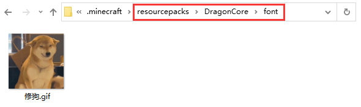

# 替换文字贴图

### 配置文件 FontConfig.yml

```
# 你要替换的文字，若写多个文字, 则每个字都会被替换
狗:
  # 贴图路径
  path: "font/修狗.gif"
  # 显示的宽度(默认为9)
  width: 9
  # 显示的高度(默认为9)
  height: 9
```

### 客户端材质文件

<figure><figcaption></figcaption></figure>

### 测试使用

1.配置完成后重载插件

2.如果修改了贴图需要在客户端按O和P重载缓存

3.在聊天栏输入  狗   即可看到文字已被替换

### 进阶配置

```
狗:
  # 贴图路径
  path: "font/修狗.gif"
  # 显示图片的宽度(默认为9)
  width: 9
  # 显示图片的高度(默认为9)
  height: 9
  # 是否需要在文字前加§才会修改贴图
  color: true
  # 图片xy轴偏移
  xOffset: 1
  yOffset: 1
  # 指定文字宽度(默认值=width)
  fontWidth: 20

```

### 示例贴图下载


