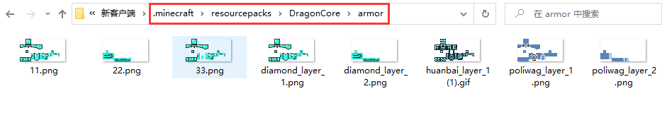

# 自定义盔甲贴图

### 配置文件 ArmorLayer.yml

```
测试盔甲贴图:
  # 匹配文本，支持 物品名，物品Lore，NBT 任意一个包含【测试盔甲】
  match: "测试盔甲"
  # 贴图名称,需要在客户端放置盔甲贴图
  # DragonCore/armor/图片.png
  layer1: "poliwag_layer_1.png"
  layer2: "poliwag_layer_2.png"
  # 额外渲染发光贴图,不需要使用请删除而不是留空
  #glowLayer1: "发光贴图.png"
  #glowLayer2: "发光贴图.png"
```


注意事项

1. 不要使用皮革装备修改贴图&#x20;

&#x20; 2\. 该功能修改的是穿在身上显示的盔甲贴图，而不是物品的贴图

&#x20; 3\. 该配置为龙核版本2.6.0才可使用,本处不提供旧版本格式教程


### 资源文件路径

<figure><figcaption></figcaption></figure>

### 使用教程

你一定会的对吧

### 示例文件下载




