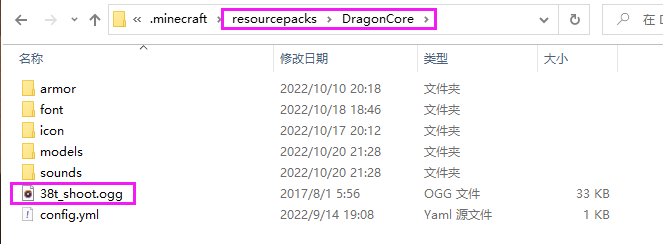

# 自定义声音文件

### 使用教程

1.可通过mythicmobs的sound技能, sound参数直接使用  文件名.ogg  即可

2.使用原版指令 /playsound 文件名.ogg master 玩家名

### 音乐文件路径

比如使用指令/playsound 38t\_shoot.ogg master 玩家名

则是将文件放置在resourcepacks/DragonCore/38t\_shoot.ogg内


自2.6.0开始可以保持指令不变的同时,将声音文件放置于sounds文件夹内

如/playsound xxx.ogg master 玩家名

对应的目录可为以下任选其一(假设两个目录都存在文件，则优先为1, 1不存在则为2)

1. &#x20;resourcepacks/DragonCore/xxx.ogg
2. resourcepacks/DragonCore/sounds/xxx.ogg


<figure><figcaption></figcaption></figure>
