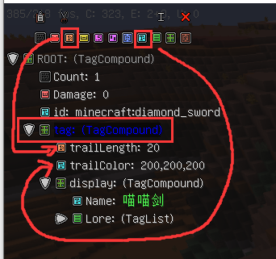

# 自定义玩家动作

### 前置需求

1. 该功能需要使用  龙之时装付费版-6.65及以上版本

### 使用教程

1. 在时装售后群内的文件夹 龙之时装--重置版内，下载\[自定义动作及基岩时装.zip]
2. 使用其内的\[测试动作2.bbmodel]文件制作动作文件并导出动作文件.json
3. 将动作文件放置于服务端plugins/DragonCore/PlayerAnimation内,重载龙核插件
4.  使用指令即可使玩家开始播放动作

    ```
    # 播放动作
    /core player_start <玩家> <动作名> <播放速度(默认为1,越小越慢)(可忽略)>
    # 停止动作
    /core player_stop <玩家>
    ```


### 自定义刀光颜色及刀光长度

为物品添加NBT节点

trailLength: 8   该值为刀光长度,默认为8

trailColor: r,g,b   该值为刀光颜色,默认为255,255,255


注意事项: 刀光长度的类型必须为橙色的int类型,其他类型将会导致无法显示刀光

Ps: 龙时6.68版本已支持string类型


<figure><figcaption></figcaption></figure>
