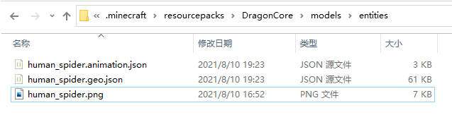
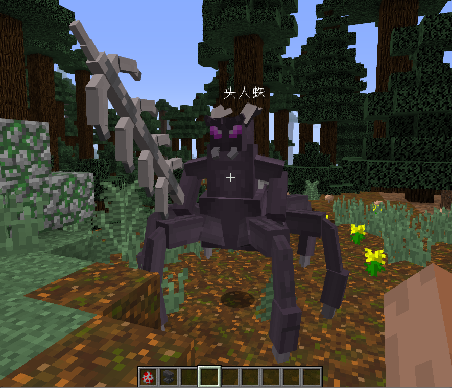

# 初阶-替换生物模型

### 配置文件EntityModel.yml

```yaml
# 重要：文件存放目录为resourcepacks/DragonCore/models/entities
# 简易配置如下,完整配置可看第三节内容
人蜘蛛:
  # 匹配的实体名称,当实体名等于 一头人蛛 时会被替换模型
  entity: "一头人蛛"
  # 指定模型文件
  model: "human_spider.geo.json"
  # 指定模型贴图
  texture: "human_spider.png"
  # 指定模型碰撞箱宽高
  width: 3
  height: 3
```

### 客户端材质文件

将填写的文件放置于客户端.minecraft/resourcepacks/DragonCore/models/entities/下



### 测试使用

1.完成EntityModel.yml的修改后，执行重载指令/dragoncore reload

2.完成资源文件放置后,在游戏内同时按下键盘按键**`o和p`**两个按键以清除客户端缓存

3.使用创造模式 拿出一个生物蛋如猪蛋，并拿一个铁砧对猪蛋进行改名

P9DD@SV7L\)7J@\_8}H.png)

4.右键地面生成该生物，可以看到猪的模型已被替换




### 文件下载


