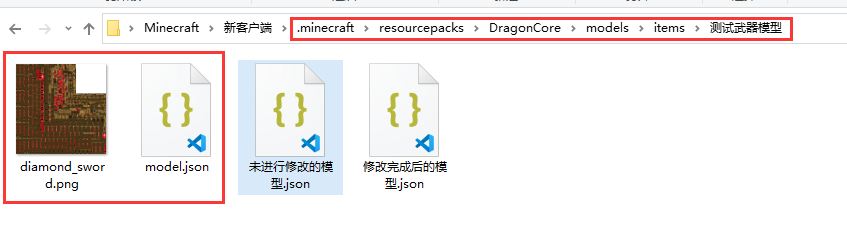

# 初阶-自定义物品模型

### 配置文件 ItemModel.yml

```
测试修改物品模型:
  # 匹配文本，支持 物品名，物品Lore，NBT 任意一个包含【物品模型1】
  match: "测试模型1"
  # 模型和材质文件均需要放置在DragonCore/models/items/<path>/文件夹内
  # 模型文件必须命名为 model.json
  # model.json文件需要进行额外的修改,可看wiki下方【打开模型文件修改模型格式】
  path: "测试武器模型"

```


路径请使用小写英文或数字, 不要使用大写英文

尽量不要使用中文, 本处只是为了展示使用教程


### 资源文件位置

<figure><figcaption></figcaption></figure>

### 注意事项

1. 模型文件必须命名为model.json
2. 模型及其所有的图片需要放在同一个目录下
3. 模型文件不能直接使用,需要对其进行修改后才可使用

### 打开模型文件修改格式

<figure><figcaption></figcaption></figure>

### 使用测试

1. 使用铁砧为物品改名为  测试模型1  即可看到物品模型已变化
2. 如果修改了贴图或更改了配置,需要额外在客户端内按下O和P以重载客户端缓存

### 资源文件下载


