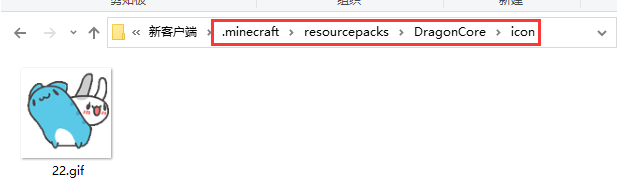
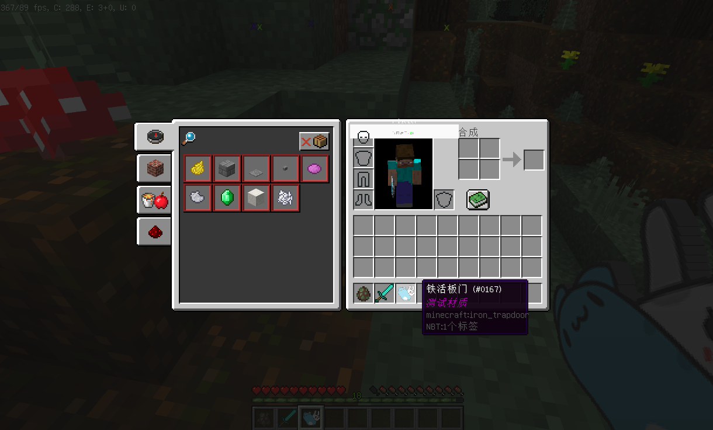

# 初阶-自定义物品贴图

### 配置文件 ItemIcon.yml

```
测试修改物品贴图:
  # 匹配文本，支持 物品名，物品Lore，NBT 任意一个包含【物品材质1】
  match: "测试材质1"
  # 贴图文件,文件需放置在resourcepacks/DragonCore/icon文件夹内
  # 请务必保证图片宽高相等,否则显示会存在问题
  texture: "22.gif"
  # 调整手持模式,武器之类等图标需要打开该选项才行,临时修改需要在客户端按O+P重载材质
  held: true
```

### 资源文件位置

<figure><figcaption></figcaption></figure>

### 使用测试

1.使用铁砧为物品改名为  测试材质1  即可看到物品模型已变化

2.如果修改了贴图或更改了配置,需要额外在客户端内按下O和P以重载客户端缓存

<figure><figcaption></figcaption></figure>

### 资源文件下载


