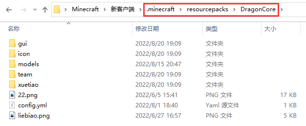

# 必看-初阶-资源文件夹

### 文件夹路径

客户端Mod将在载入后,自动在**.minecraft/resourcepacks**/下生成 **DragonCore** 文件夹

所有有关龙之核心的材质模型等文件均需要放置在该文件夹下,除开**有说明需要指定目录**的设置

其他所有文件需要引用需要填写完整路径，如   team/xxx.png

### 文件夹加密

版本需求：插件及mod至少为2.5.8.5版本

重点注意:  该功能会将客户端DragonCore文件夹下所有文件进行加密

&#x20;                并对基岩模型json文件进行二次加密，该过程无法逆向获取出文件

&#x20;                因此请务必 **【备份资源文件】 【备份资源文件】 【备份资源文件】**&#x20;

&#x20;                     **【备份资源文件】 【备份资源文件】 【备份资源文件】**

使用教程：在config.yml内ZipPassword设置一个八位数密码

&#x20;                 进入游戏后,输入 **/core encrypt** 指令即可

&#x20;                 加密完成后则可将客户端分发给玩家使用

&#x20;              &#x20;
