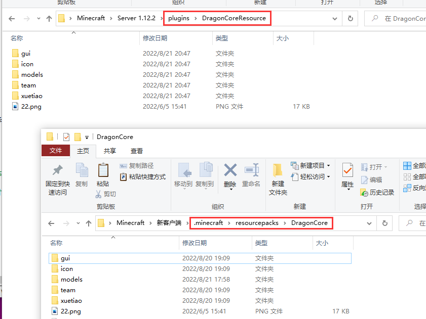

# 中阶-服务端同步文件


功能已删除，请勿使用


### 文件存放路径默认路径: 服务端plugins/DragonCoreResource

可选路径: 在服务端插件配置文件config.yml内填写**ResourcePack**选项

关闭功能: 在服务端插件配置文件config.yml内填写**SyncResource: false**

### 注意事项&#x20;

* [x] 在config.yml内ZipPassword设置一个八位数密码
* [x] 该功能仅建议作为小型热更新材质文件时使用，不建议用于存放所有材质资源
* [x] 网易服务器请勿使用该功能
* [x] 使用后请勿修改config.yml中的Password选项,否则会导致文件无法读取
* [x] config.yml中Password密码需要设置为8位数

###

&#x20;              &#x20;
