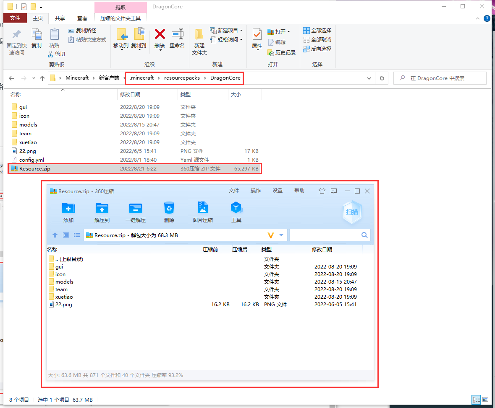

# 中阶-加密压缩包


**注意事项:** 压缩包内文件及文件目录不允许存在中文, 否则可能会无法读取

&#x20;               路径内的config.yml为客户端配置文件,请勿压缩


### 压缩包信息

压缩格式: 仅支持ZIP压缩

文件命名: 必须命名为 **Resource.zip**

存放路径: .minecraft/resourcepacks/DragonCore/Resource.zip

密码设定: 支持为**zip**设置密码，但密码要填写到插件配置文件夹**config.yml**中

### 压缩包教程

打开**.minecraft/resourcepacks/DragonCore**路径

选中路径下所有文件,并右键以zip格式压缩

### 压缩示例

